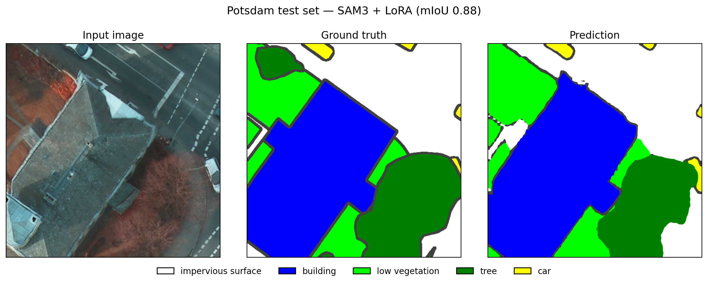

# SAM3-PEFT

**Parameter-efficient fine-tuning of SAM 3 for remote-sensing semantic segmentation.**

Three PEFT methods (LoRA, frozen-backbone Linear Probing, FFT-prompt Adapter) on top of a vendored Meta SAM 3 image backbone, evaluated on seven public remote-sensing datasets (aerial / UAV / satellite). All training and evaluation runs from YAML configs.



*Inference on a Potsdam test image. Best run in this repo: SAM3 + LoRA on Potsdam, mIoU **0.8806**.*

---

## Methods

| Method                | Module                            | Trainable params *(MA Buildings run)* | % of total |
|-----------------------|-----------------------------------|--------------------------------------:|----------:|
| `sam3_linear_probing` | `peft/sam3_linear_probing.py`     |                             2,299,652 |    0.50 % |
| `sam3_lora`           | `peft/sam3_lora.py` + `peft/lora.py` |                          4,539,139 |    0.98 % |
| `sam3_adapter`        | `peft/sam3_adapter.py` + `peft/adapter.py` |                       337,891 |    0.07 % |

A common factory `peft.build_peft_model(method=...)` returns a wrapper with a unified interface (`forward(images, multimask_output, image_size) → {"masks": ...}`, `save_parameters`, `load_parameters`).

## Datasets

All inputs are resized to **1008×1008** for both training and evaluation.

| Dataset                  | Type                | Train | Val   | Test  |
|--------------------------|---------------------|------:|------:|------:|
| Potsdam (ISPRS)          | aerial 5cm GSD      | 2,765 |   691 | 2,016 |
| Vaihingen (ISPRS)        | aerial 9cm GSD      |   276 |    68 |   398 |
| UAVid                    | UAV oblique 4K      | 8,000 | 2,800 |   150 |
| LoveDA                   | satellite (urban+rural) | 2,522 | 1,669 |   —   |
| Massachusetts Buildings  | aerial 1m GSD       | 1,233 |    36 |    90 |
| Massachusetts Roads      | aerial 1m GSD       | 9,972 |   126 |   441 |
| WHU Building             | aerial 0.3m GSD     | 5,732 | 1,228 | 1,228 |

Datasets follow the MMSeg-style layout `root/img_dir/{split}/` + `root/ann_dir/{split}/`, except UAVid and Massachusetts which use `root/{split}/{images,masks}/`. Loaders live in [`datasets.py`](datasets.py).

## Results

Best validation checkpoint, evaluated on the held-out test split (LoveDA reports val numbers since the public test set is unlabeled):

| Dataset                  | Linear Probing |  LoRA  | Adapter |
|--------------------------|:--------------:|:------:|:-------:|
| Potsdam                  |     0.7186     | 0.8806 | 0.8735  |
| Vaihingen                |     0.6917     | 0.8326 | 0.8152  |
| UAVid                    |     0.4554     | 0.6106 | 0.6619  |
| LoveDA                   |     0.4237     | 0.5663 | 0.5518  |
| Massachusetts Buildings  |     0.7381     | 0.8278 | 0.8087  |
| Massachusetts Roads      |     0.7048     | 0.8128 | 0.8077  |
| WHU Building             |     0.8877     | 0.9492 | 0.9403  |

Numbers are mIoU. Full per-class IoU and overall accuracy: see [`evaluation_results.md`](evaluation_results.md).

---

## Pre-trained weights

Best-checkpoint weights for all 21 runs (3 methods × 7 datasets) are available on Google Drive:

**[Download weights (Google Drive)](https://drive.google.com/drive/folders/1CII_0gT69e2aqylGJUG9XZxPQ9ot6Pfa?usp=sharing)**

The folder is organised as:

```
sam3_peft_weights/
├── linear_probing/          # ~8.8 MB each
│   ├── potsdam.pth
│   ├── vaihingen.pth
│   ├── uavid.pth
│   ├── loveda.pth
│   ├── massachusetts_buildings.pth
│   ├── massachusetts_roads.pth
│   └── whu_building.pth
├── lora/                    # ~27 MB each
│   └── ...
└── adapter/                 # ~1.4 MB each
    └── ...
```

Each file is the `best.pth` for that run (best validation mIoU checkpoint). To evaluate with a downloaded weight:

```bash
python test.py --config configs/sam3_lora_potsdam.yaml \
  --checkpoint /path/to/sam3_peft_weights/lora/potsdam.pth
```

---

## Setup

```bash
git clone <this-repo> sam3-peft && cd sam3-peft
python -m venv venv && source venv/bin/activate
pip install -r requirements.txt
# Install PyTorch matching your CUDA, e.g.:
#   pip install torch torchvision --index-url https://download.pytorch.org/whl/cu118
```

The vendored Meta SAM 3 model and BPE assets live inside the repo (`sam3/` + `sam3/assets/`); no external SAM-3 install is required.

Set `dataset.root` in each config to the local path of your dataset before running. Optional: set `model.sam3_checkpoint` and `model.bpe_path` to override the bundled defaults.

## Train

```bash
python train.py --config configs/sam3_lora_potsdam.yaml
# Override GPU from CLI:
python train.py --config configs/sam3_lora_potsdam.yaml --gpu 1
```

Each run writes to `experiments/<experiment_name>_<timestamp>/`:

- `train.log` — full stdout / stderr
- `best.pth`, `last.pth`, `epoch_*.pth` — checkpoints
- `tb_logs/` — TensorBoard scalars
- `training_summary.txt` — final mIoU, OA, peak GPU memory, wall-clock time

## Evaluate

```bash
python test.py --config configs/sam3_lora_potsdam.yaml \
  --checkpoint experiments/<run>/best.pth
```

Saves an `eval_<timestamp>/eval.log` with per-class IoU, mIoU, OA. Pass `--save_preds` to write per-image prediction PNGs. Ten random side-by-side `image | gt | pred` panels are always saved under `eval_<timestamp>/visualizations/`.

## Evaluate with TTA

D4 test-time augmentation (8 views: identity + 90°/180°/270° rotations + h-flip combinations, merged by mean of softmax logits):

```bash
python test_tta.py --config configs/sam3_lora_potsdam.yaml \
  --checkpoint experiments/<run>/best.pth
```

## One-command train + evaluate

```bash
./train.sh configs/sam3_lora_potsdam.yaml
```

---

## Project layout

```
.
├── train.py / test.py / test_tta.py / train.sh    # Entry points
├── datasets.py                                    # All dataset loaders + create_dataset(...)
├── peft/                                          # PEFT wrappers
│   ├── lora.py             # generic LoRA layers
│   ├── sam3_lora.py
│   ├── sam3_linear_probing.py
│   ├── adapter.py          # generic adapter / FFT prompt generator
│   └── sam3_adapter.py
├── sam3/                                          # Vendored Meta SAM 3 (model + BPE assets)
├── configs/                                       # 21 YAML configs (3 methods × 7 datasets)
├── utils/
│   ├── config.py           # YAML loader with attribute access
│   ├── losses.py           # Dice loss
│   ├── tta.py              # D4 test-time augmentation
│   └── run_log.py          # Timestamped run dirs + tee logging
├── experiments/                                   # Created by train.py / test.py (gitignored)
└── pre_weight/                                    # Pretrained SAM weights (gitignored)
```

## Configs

There are 21 configs in `configs/` (one per `{method × dataset}`). All follow the same shape:

```yaml
experiment:
  name: sam3_lora_potsdam
  output_dir: experiments
  seed: 1337
  gpu: "0"

dataset:
  type: potsdam            # potsdam | vaihingen | uavid | loveda
                           # massachusetts_buildings | massachusetts_roads | whu_building
  root: /path/to/dataset
  image_size: 1008
  num_classes: 6
  augment: true
  exclude_classes: []

model:
  method: sam3_lora        # sam3_lora | sam3_linear_probing | sam3_adapter
  sam3_checkpoint: null    # null = use bundled
  bpe_path: null
  rank: 8                  # LoRA-only
  alpha: 16                # LoRA-only
  dropout: 0.0             # LoRA-only
  # sam3_adapter-only:
  scale_factor: 32
  input_type: fft
  freq_nums: 0.25
  prompt_type: highpass
  tuning_stage: "1234"
  handcrafted_tune: true
  embedding_tune: true
  adaptor: adaptor

training:
  epochs: 50
  batch_size: 24
  num_workers: 4
  lr: 3.0e-4
  weight_decay: 0.01
  warmup_epochs: 2
  grad_clip_norm: 1.0
  amp: true
  save_every: 5
  val_every: 1
  log_every: 20
  early_stopping_patience: 10

resume:
  checkpoint: null
  epoch: 0
```

The only field that *must* be set per machine is `dataset.root`.

---

## Augmentations

Joint image+mask augmentations (training only, [`datasets.py`](datasets.py) → `_augment`):

- horizontal flip (p=0.5)
- vertical flip (p=0.5) — disabled for UAVid (oblique imagery)
- 90° / 180° / 270° rotation (uniform from {0,1,2,3})
- brightness, contrast, saturation jitter ±15 % (each p=0.5)

## Loss

Cross-entropy + Dice (1:1), with `ignore_index` honoured. Implementation: `utils/losses.py`.
